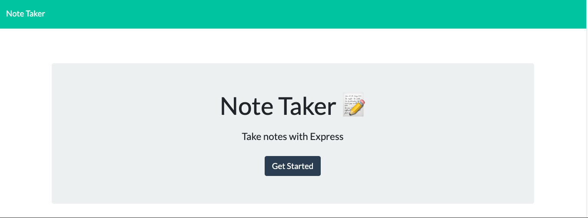
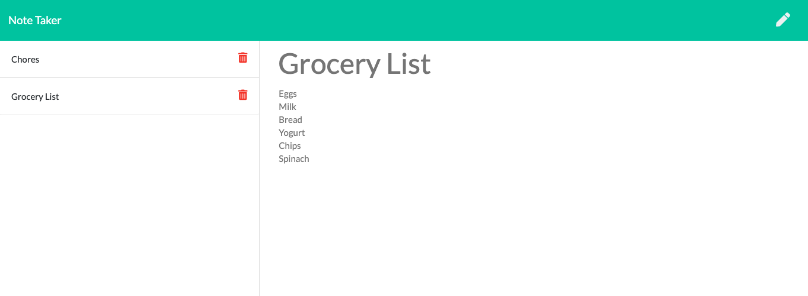

# Unit 11 Express Homework: Note Taker
To view application click [here](https://limitless-scrubland-31066.herokuapp.com/)
- - - -
## Application
- - - -

For users that need to keep track of a lot of information, it's easy to forget or be unable to recall something important. Being able to take persistent notes allows users to have written information available when needed.

## Preview
- - - -

## Usage
- - - -

* Allows users to create and save notes.

* Allows users to view previously saved notes.

* Allows users to delete previously saved notes.

## Instructions
- - - -
1. Clone respository to your working directory
2. In your code editiing terminal run `npm install`
3. After installation, run `node server.js`
4. The console log will say `App listening on PORT: 3000'
5. Click this http://localhost:3000/ or copy and paste into your browser
